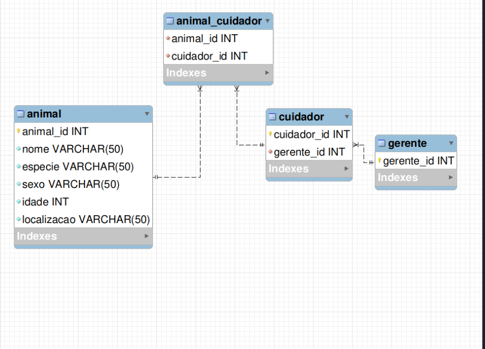
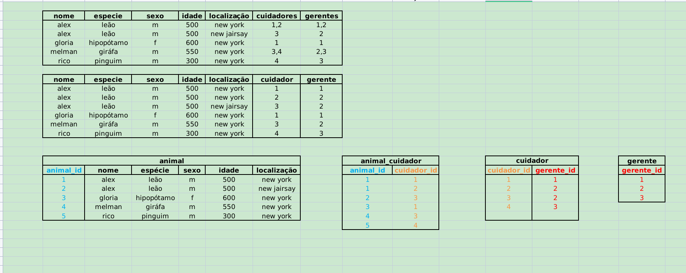

# Exercícios - agora, a prática:

## Exercício 1: 🚀 Um zoológico precisa de um banco de dados para armazenar informações sobre os seus animais. As informações a serem armazenadas sobre cada animal são:

    Nome;
    Espécie;
    Sexo;
    Idade;
    Localização;

## Cada animal também possui vários cuidadores, e cada cuidador pode ser responsável por mais de um animal. Além disso, cada cuidador possui um gerente, sendo que cada gerente pode ser responsável por mais de um cuidador.

# Exercícios - normalização

## Consulte as imagens associadas aos exercícios como referência para resolução.

## Não é necessário montar queries para resolver os exercícios. Crie novas planilhas com suas respostas.

